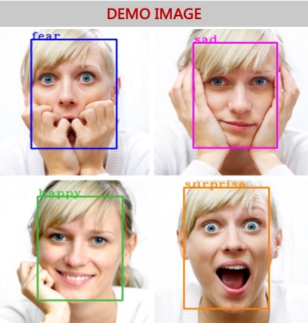

# Facial Detection, Recognition and Emotion Detection




## Introduction

Humans have always had the innate ability to recognize and distinguish between faces. The same has been achieved by computers using opencv and deep learning. This blog briefly throws some light on this ability of computers to excel in facial detection, facial recognition and emotion detection by using the results of experimentation and analysis done on these topics. The blog  has been divided into  three parts:

1. ### Facial Detection

2. ### Facial Recognition

3. ### Emotion Detection

We will walk around through these topics one by one briefly.

### Facial Detection

Detecting all the faces from an image. The facial detection is an first and important part in bringing out the results of facial recognition. It can be achieved by using the amazing python library "face_recognition" which performs very well in detecting location of faces from an image. The following image shows there are two faces detected from the given image.


The below snippet shows how to use the face_recognition library for detecting faces.

```
face_locations = face_recognition.face_locations(image)
top, right, bottom, left = face_locations[0]
face_image = image[top:bottom, left:right]
```

The full code can be taken from the github.

### Facial Recognition

Facial Recognition verifies if  two faces are same. The use of facial recognition is huge in security, bio-metrics, entertainment, personal safety, etc. The python library "face_recognition" offers a very good performance in recognizing if two faces match with each other giving the result as True or False. The steps involved in facial recognition are

- Find face in an image
- Analyze facial feature
- Compare against both the faces
- Returns True if matched or else False.

Let us understand by seeing the images below

###### Image1


###### Image2


The  face_recognition library compares the above two faces and returns the result as "True"  stating that two images having different pose are recognized as same

The below snippet shows how to use the face_recognition library for recognizing faces.

```
image1 = face_recognition.load_image_file("../test_images/index1.jpg")
image2 = face_recognition.load_image_file("../test_images/index2.jpeg")
encoding_1 = face_recognition.face_encodings(image1)[0]
encoding_2 = face_recognition.face_encodings(image1)[0]
results = face_recognition.compare_faces([encoding_1], encoding_2,tolerance=0.50)
print results
[True]
```


Similarly,  let us consider an image of a different person(Image3) and compare it with the Image1

###### Image3


The  same is done for Image1 and Image3 which are the images of two persons  and the result returned after comparison is "False" denoting the two  images are not recognized as same.

###### So, we can see clearly, the two images of same person though in different poses are recognized as same and those of different persons are not recognized as same.


### Emotion Detection

Humans are used to non verbal communication. The emotions expressed increases the clarity of any thoughts and ideas. It becoms quite interesting when a computer can capture this complex feature of humans, ie emotions. The above topic talks about building a model which can detect an emotion from an image. There key points to be followed are:

1. Data gathering and  augmentation

   The dataset taken was **"fer2013"**. It can be downloaded through the link "https://github.com/npinto/fer2013". Image augmentation was performed on this data.

2. Model building

   The model architecture consists of CNN Layer, Max Pooling, Batch Normalization and fully convolutional layer. 

3. Training

   The model was trained  by  using variants of above layers mentioned in model building and by varying hyperparameters. The best model was able to achieve 61.3% of validation accuracy

4. Testing

   The model was tested with sample images. It can be seen below:

   

   The image shows the emotion of "Surprise"

   Let us see the prediction of the model trained:

   

   ```
   emotion_dict= {'Angry': 0, 'Sad': 5, 'Neutral': 4, 'Disgust': 1, 'Surprise': 6, 'Fear': 2, 'Happy': 3}
   face_image  = cv2.imread("..test_images/39.jpg")
   face_image = cv2.resize(face_image, (48,48))
   face_image = cv2.cvtColor(face_image, cv2.COLOR_BGR2GRAY)
   face_image = np.reshape(face_image, [1, face_image.shape[0], face_image.shape[1], 1])
   model = load_model("./emotion_detector_models/model.hdf5")
   predicted_class = np.argmax(model.predict(face_image))
   label_map = dict((v,k) for k,v in emotion_dict.items()) 
   predicted_label = label_map[predicted_class]
   Surprise
   ```

   

   We see the predicted label by the model is same as actual label. 

### Future Work:

​	More image augmentation and hyperparameter tuning to further increase the accuracy of model. 

​	Facial Recognition of two faces having different profile(left and front profile)

​	Emotion Detection of different profiles(other than front profile)

### Conclusion:

​	We can clearly see the wonders of AI in facial recognition. The amazing python library of 			  face_recognition, pretrained  deep learning models and open-cv  have already gained so much performance and have made our life easier. There are lots of other materials that are helpful and bring into picture different approaches used in achieving the same goal.

You can see the full code on the following github link:

https://github.com/priya-dwivedi/face_and_emotion_detection

